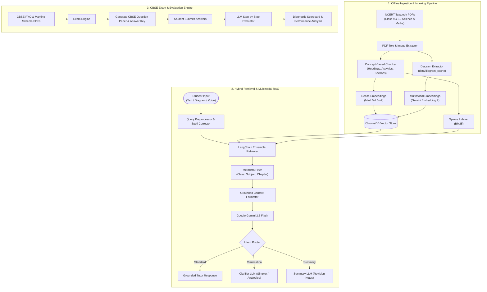

# 🎓 AI Pathshala: NCERT-Grounded Multimodal RAG AI Tutor & CBSE Examination Engine

[](https://www.python.org/)
[](https://fastapi.tiangolo.com/)
[](https://www.trychroma.com/)
[](https://ai.google.dev/)
[](https://www.langchain.com/)
[](LICENSE)

**AI Pathshala** is an advanced, strictly grounded pedagogical AI tutor and examination platform designed for CBSE students (Grades 9 & 10 for Science and Mathematics). Built upon a robust **Hybrid Retrieval-Augmented Generation (RAG)** architecture, it eliminates LLM hallucinations by answering strictly from official **NCERT textbook PDFs**, supporting **diagram visual explanations**, **voice queries**, and an automated **CBSE Exam Generator & Evaluator** driven by official CBSE Marking Schemes and Previous Year Questions (PYQs).

---

## 📺 Project Demo Video

Experience **AI Pathshala** in action — covering interactive NCERT Q&A, diagram analysis, voice interactions, and automated test generation with rubric evaluation:

👉 **[Watch the AI Pathshala Demonstration Video](https://drive.google.com/file/d/1d_ggx2wdoD5TgigTprvXc6uGxlJemX2i/view)**

> 🔗 **Direct URL:** `https://drive.google.com/file/d/1d_ggx2wdoD5TgigTprvXc6uGxlJemX2i/view`

---

## 🌟 Key Highlights & Features

### 1. 📚 Zero-Hallucination NCERT Grounding
- **Strict Citation & Attribution**: Answers are strictly derived from official NCERT textbooks. Every answer provides:
  1. Step-by-step Explanation
  2. Concrete Textbook Example
  3. Formulas Used (if applicable)
  4. Precise NCERT Reference (Chapter & Page numbers)
- **Anti-Hallucination Fallback**: If retrieved chunk similarity falls below the confidence threshold, the model gracefully refuses to speculate.
- **Concept-Based Chunking**: Uses heuristic semantic boundary detection (headings, activities, exercises) instead of arbitrary token splits to maintain conceptual coherence.

### 2. 🔍 Advanced Hybrid Retrieval System
- **Dense Vector Search**: Powered by `sentence-transformers/all-MiniLM-L6-v2` and persistent **ChromaDB**.
- **Sparse Keyword Search**: Full-text BM25 token matching via `rank-bm25`.
- **LangChain Ensemble**: Combines dense vector similarity with sparse keyword matching using Reciprocal Rank Fusion (RRF).
- **Query Spell-Correction**: Automatically corrects misspelled student queries before running the retrieval pipeline.
- **Strict Metadata Filtering**: Enforces scoping to the student's selected `Class`, `Subject`, and optional `Chapter`.

### 3. 🖼️ Multimodal Diagram Intelligence
- **Unified Multimodal Vector Index**: Powered by Google's `gemini-embedding-2-preview` model.
- **Automated PDF Diagram Extraction**: Automatically extracts high-resolution diagrams embedded inside textbook PDFs into `data/diagram_cache`.
- **Visual Question Answering**: Students can upload textbook diagrams, circuits, ray diagrams, or handwritten problem sketches; Gemini Flash reasons over the visual input grounded in NCERT concepts.

### 4. 🎙️ Voice-Activated Interaction
- **Speech-to-Text Pipeline**: Upload or record spoken student queries directly from the interface.
- **Speech-Optimized Delivery**: Generates both standard grounded textual answers and natural `spoken_text` structured for Text-to-Speech (TTS) readout.

### 5. 📝 CBSE Examination Engine & Auto-Evaluator
- **Official Rubric & PYQ Grounding**: Calibrated using official CBSE Class 10 Previous Year Questions (`pyqs/maths_pyq`, `pyqs/science_pyq`) and Official Marking Schemes (`marking_scheme/MS_maths`, `MS_science`).
- **Custom Exam Paper Generation**: Configure Class, Subject, Specific Chapters, Total Marks, and Difficulty level (`easy`, `medium`, `hard`) to generate full sectioned examination papers (Section A, B, C, D, etc.).
- **Step-by-Step Marking Scheme**: Generates detailed answer keys with point allocations per step.
- **Automated Answer Evaluation**: Evaluates student submissions (free-form text or structured JSON), awarding marks per question, identifying conceptual errors, calculating overall percentages/grades, and generating a diagnostic summary of strong areas, weak areas, and revision suggestions.

### 6. 🧠 Adaptive Pedagogical Modes
- **Clarification Mode**: Detects phrases like *"explain again"*, *"step by step"*, or *"didn't understand"*, and triggers `ClarifierLLM` to break down concepts into simpler, age-appropriate language with analogies.
- **Revision Summary Mode**: Triggers `SummaryLLM` on requests like *"summarize"*, *"short notes"*, or *"in brief"* to create concise revision bullet points.

---

## 🏗️ System Architecture



---

## 📁 Repository Structure

```plaintext
AI Pathshala/
├── books/                             # NCERT Textbook PDFs
│   ├── Mathematics/                   # Class 9 & 10 Maths chapters
│   └── Science/                       # Class 9 & 10 Science chapters
├── data/                              # Local persistent storage (gitignored)
│   ├── chroma/                        # Persistent ChromaDB vector collections
│   └── diagram_cache/                 # Extracted PDF textbook diagrams
├── marking_scheme/                    # Official CBSE Marking Scheme PDFs
│   ├── MS_maths/                      # Mathematics marking schemes
│   └── MS_science/                    # Science marking schemes
├── pyqs/                              # CBSE Previous Year Question Paper PDFs
│   ├── maths_pyq/                     # Mathematics PYQs
│   └── science_pyq/                   # Science PYQs
├── src/
│   ├── aitutor/ (and aipathshala/)
│   │   ├── api/
│   │   │   ├── main.py                # FastAPI application routes & endpoints
│   │   │   └── static/
│   │   │       └── index.html         # Modern interactive web interface
│   │   ├── exam/
│   │   │   └── engine.py              # CBSE test generation & evaluation engine
│   │   ├── generation/
│   │   │   ├── grounded_llm.py        # Core NCERT-grounded answer generation
│   │   │   ├── clarifier_llm.py       # Simpler explanations & pedagogical clarification
│   │   │   └── summary_llm.py         # Concise topic summarization & revision notes
│   │   ├── ingest/
│   │   │   ├── book_id.py             # Book & chapter metadata mapping
│   │   │   ├── chunking.py            # Concept-based heuristic splitting
│   │   │   ├── pdf_extract.py         # PyMuPDF text & page extractor
│   │   │   ├── pdf_diagrams.py        # PDF embedded diagram extraction
│   │   │   └── pipeline.py            # End-to-end ingestion pipeline
│   │   ├── multimodal/
│   │   │   └── service.py             # Multimodal indexing, diagram VQA & voice QA
│   │   ├── rag/
│   │   │   └── tutor.py               # Orchestrator combining retrieval + LLM
│   │   ├── retrieval/
│   │   │   ├── bm25_retriever.py      # Sparse BM25 keyword retrieval
│   │   │   ├── langchain_hybrid.py    # Ensemble dense + sparse retriever
│   │   │   ├── query_corrector.py     # Typo & query spelling correction
│   │   │   ├── reranker.py            # Retrieval ranking module
│   │   │   └── retriever.py           # Top-level retriever interface
│   │   ├── vectorstore/
│   │   │   └── chroma_store.py        # ChromaDB client & collection management
│   │   ├── cli.py                     # Command-line interface definition
│   │   ├── config.py                  # Environment config & model definitions
│   │   └── types.py                   # Pydantic & dataclass types
├── .env.example                       # Example environment variables
├── .gitignore                         # Git exclusion rules
├── pyproject.toml                     # Project packaging configuration
└── requirements.txt                   # Python dependencies
```

---

## ⚙️ Installation & Setup

### 1. Prerequisites
- **Python**: version `3.10` or higher
- **Google Gemini API Key**: Obtain a free or paid API key from [Google AI Studio](https://aistudio.google.com/apikey).

### 2. Clone the Repository
```bash
git clone https://github.com/Aanchalkanwar/AI-Pathshala.git
cd AI-Pathshala
```

### 3. Create and Activate a Virtual Environment
- **Windows (PowerShell)**:
  ```powershell
  python -m venv .venv
  .venv\Scripts\Activate.ps1
  ```
- **macOS / Linux**:
  ```bash
  python3 -m venv .venv
  source .venv/bin/activate
  ```

### 4. Install Dependencies
```bash
pip install -r requirements.txt
pip install -e .
```

### 5. Configure Environment Variables
Copy `.env.example` to `.env`:
```bash
copy .env.example .env     # Windows
cp .env.example .env       # macOS / Linux
```

Edit `.env` and fill in your Gemini API key:
```env
# Google AI Studio API Key
GEMINI_API_KEY=your_actual_gemini_api_key_here

# (Optional) Model configurations
GEMINI_MODEL=models/gemini-2.5-flash
GEMINI_EMBED_MODEL=models/gemini-embedding-2-preview
```

---

## 🚀 Step-by-Step Usage Guide

### Step 1: Ingest NCERT Textbooks
Ingest the PDF chapters into the local ChromaDB vector store.

- **Class 10 Science**:
  ```bash
  python -m aitutor ingest --books-dir books/Science --class 10 --subject Science
  ```
- **Class 10 Mathematics**:
  ```bash
  python -m aitutor ingest --books-dir books/Mathematics --class 10 --subject Mathematics
  ```

*(To ingest a single chapter, append `--chapter <number_or_name>`)*

---

### Step 2: Build the Multimodal Index (Optional for Diagrams)
Extract diagrams from textbook PDFs and build multimodal embeddings for visual reasoning:

```bash
python -m aitutor mm-index --class 10 --subject Science --diagrams-dir books --extract-pdf-diagrams --max-text-chunks 600 --text-batch-size 16 --resume
```
> **Tip for Free-Tier Quota:** `--resume` allows pausing and continuing indexing across multiple sessions without restarting from scratch.

---

### Step 3: Launch the Web Application
Start the FastAPI server:

```bash
uvicorn aitutor.api.main:app --reload --host 0.0.0.0 --port 8000
```

Open your browser at:
👉 **`http://localhost:8000`**

#### In the Web UI:
1. **Choose Study Context**: Select your **Class** (9 or 10) and **Subject** (Science or Mathematics).
2. **Select Mode**:
   - **Ask Question Mode**: Chat, upload diagrams (`🖼️`), or speak questions (`🎤`). Ask follow-ups, request simpler explanations, or ask for chapter revision summaries.
   - **Give Test Mode**: Select chapters, difficulty level, and total marks to generate a CBSE paper. Input your answers and click **Evaluate Test** to view your score, breakdown, and personalized feedback.

---

### Step 4: Using the Command-Line Interface (CLI)

#### 💬 1. Ask a Grounded Question
```bash
python -m aitutor ask --class 10 --subject Science --chapter 1 "What is a balanced chemical equation and why must it be balanced?"
```

#### 🖼️ 2. Explain a Diagram
```bash
python -m aitutor diagram-ask --class 10 --subject Science --image-path path/to/diagram.png
```

#### 🎙️ 3. Spoken Voice Query
```bash
python -m aitutor voice-ask --class 10 --subject Science --audio-path student_question.mp3 --mime-type audio/mpeg
```

---

## 📡 REST API Reference

| Method | Endpoint | Description |
| :--- | :--- | :--- |
| `GET` | `/` | Web Application UI |
| `GET` | `/api/contexts` | List available Classes and Subjects indexed in ChromaDB |
| `POST` | `/api/chat/start` | Initialize a session with `class` and `subject` |
| `POST` | `/api/chat/{session_id}/ask` | Submit text query (Auto-routes to Tutor / Clarifier / Summary) |
| `POST` | `/api/chat/{session_id}/ask/diagram` | Multi-part diagram upload (`image`) with question grounding |
| `POST` | `/api/chat/{session_id}/ask/voice` | Multi-part audio upload (`audio`) returning transcript + answer |
| `POST` | `/api/exam/run` | Generate CBSE examination paper or evaluate student answers |
| `POST` | `/api/multimodal/reindex` | Rebuild multimodal image & text vector index |
| `GET` | `/api/chat/{session_id}/history` | Retrieve full chat history for the active session |

---

## 🛡️ Anti-Hallucination & Pedagogical Guardrails

1. **Context Filtering**: All queries are bounded strictly to the active Class & Subject metadata.
2. **Confidence Thresholding**: Chunks below a similarity threshold ($0.35$ cosine similarity) are discarded, triggering a friendly refusal rather than fabricated answers.
3. **Dual Query Fallback**: Typo-corrected queries run first; if unindexed, the system falls back to raw query terms before refusing.
4. **CBSE Step Marking**: Test evaluation strictly rewards intermediate mathematical steps, unit consistency, and scientific justifications rather than final numerical values alone.

---

## 👥 Contributors & Acknowledgements

- **Author**: Anjali Singh & Aanchal Kanwar
- **Curriculum Source**: [NCERT (National Council of Educational Research and Training)](https://ncert.nic.in/)
- **Exam Patterns & Rubrics**: [CBSE (Central Board of Secondary Education)](https://cbse.gov.in/)
- **Core Models**: Google Gemini 2.5 Flash & Gemini Embedding 2 via `google-genai` SDK

---

## 📄 License
This project is open-source and licensed under the [MIT License](LICENSE).
